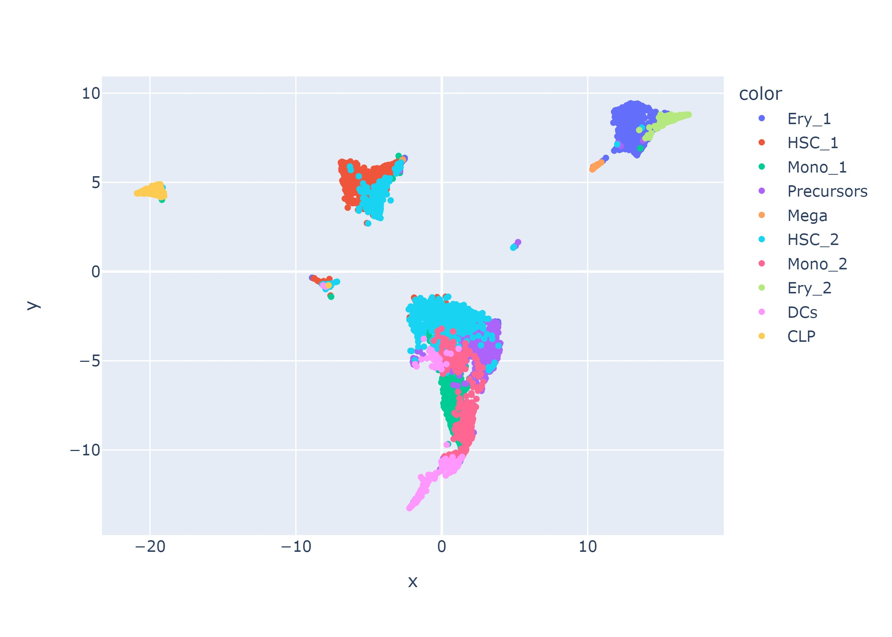
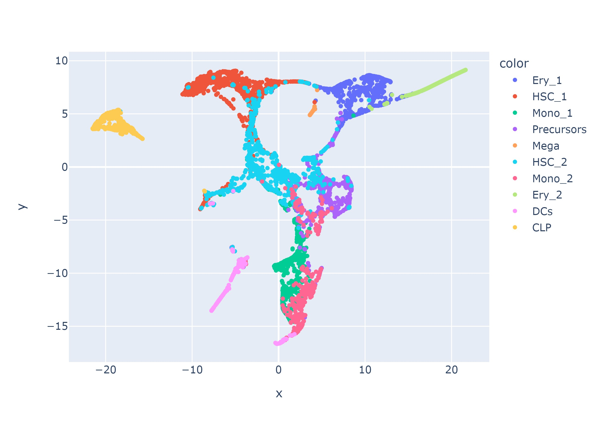
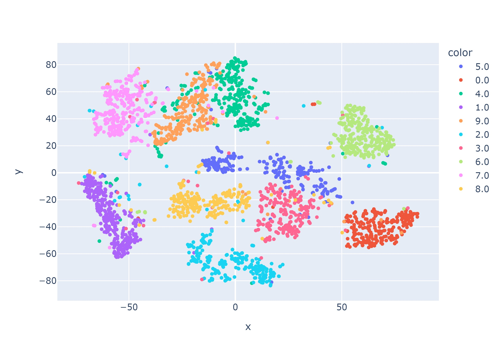
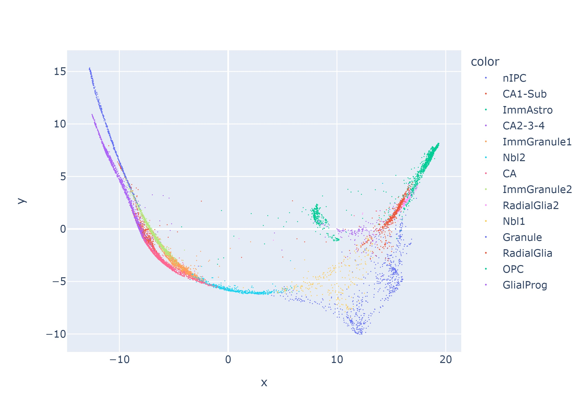
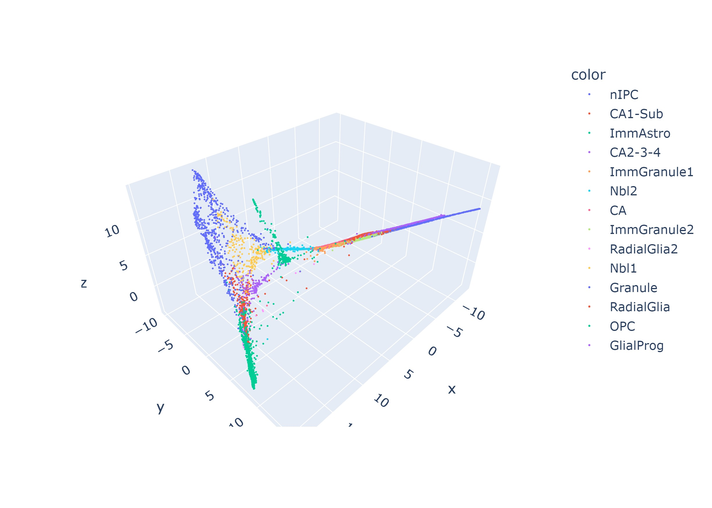

<div id="top"></div>
<!--
*** Thanks for checking out the Best-README-Template. If you have a suggestion
*** that would make this better, please fork the repo and create a pull request
*** or simply open an issue with the tag "enhancement".
*** Don't forget to give the project a star!
*** Thanks again! Now go create something AMAZING! :D
*** Link : https://raw.githubusercontent.com/othneildrew/Best-README-Template/master/BLANK_README.md
-->

<!-- PROJECT SHIELDS -->
<!--
*** I'm using markdown "reference style" links for readability.
*** Reference links are enclosed in brackets [ ] instead of parentheses ( ).
*** See the bottom of this document for the declaration of the reference variables
*** for contributors-url, forks-url, etc. This is an optional, concise syntax you may use.
*** https://www.markdownguide.org/basic-syntax/#reference-style-links
-->
[![Contributors][contributors-shield]][contributors-url]
[![Forks][forks-shield]][forks-url]
[![Stargazers][stars-shield]][stars-url]
[![Issues][issues-shield]][issues-url]
[![MIT License][license-shield]][license-url]


<!-- PROJECT LOGO -->
<br />
<div align="center">
  <a href="https://github.com/UTSW-Software-Engineering-Course-2022/module_1_austinmarckx">
    
  </a>

<h3 align="center">DimRed</h3>

  <p align="center">
    Dimensionality reduction methods 
    <br />
    <a href="https://github.com/UTSW-Software-Engineering-Course-2022/module_1_austinmarckx"><strong>Explore the docs »</strong></a>
    <br />
    <br />
    <a href="https://github.com/UTSW-Software-Engineering-Course-2022/module_1_austinmarckx">View Demo</a>
    ·
    <a href="https://github.com/UTSW-Software-Engineering-Course-2022/module_1_austinmarckx/issues">Report Bug</a>
    ·
    <a href="https://github.com/UTSW-Software-Engineering-Course-2022/module_1_austinmarckx/issues">Request Feature</a>
  </p>
</div>


<!-- TABLE OF CONTENTS -->
<details>
  <summary>Table of Contents</summary>
  <ol>
    <li>
      <a href="#about-the-project">About The Project</a>
    </li>
    <li>
      <a href="#getting-started">Getting Started</a>
      <ul>
        <li><a href="#prerequisites">Prerequisites</a></li>
        <li><a href="#installation">Installation</a></li>
      </ul>
    </li>
    <li><a href="#usage">Usage</a></li>
    <li><a href="#roadmap">Roadmap</a></li>
    <li><a href="#license">License</a></li>
    <li><a href="#contact">Contact</a></li>
    <li><a href="#acknowledgments">Acknowledgments</a></li>
  </ol>
</details>


<!-- ABOUT THE PROJECT -->
## About The Project

Here we implement two non-linear dimensionality reduction methods.  Links to the original authors are provided:
- [TSNE](https://lvdmaaten.github.io/tsne/)
- [GraphDR](https://github.com/jzthree/quasildr)

<p align="right">(<a href="#top">back to top</a>)</p>

<!-- GETTING STARTED -->
## Getting Started

<b> Clone the repository</b>
  ```sh
  git clone https://github.com/UTSW-Software-Engineering-Course-2022/module_1_austinmarckx.git
  ```

### Prerequisites

Requirements for running the modules are listed in `requirements.txt`. These can be directly installed to your virtual environement with pip using the following command:
```sh
pip install -r requirements.txt
```

### Installation

<b>Set up your virtual env</b>
Anaconda is the recommended virtual environement manager.  Below demonstrates how to set up dimred using conda

```sh
conda create --name dimred python=3.9 -y
conda activate dimred
# If you are not in the module directory go there now
# cd path/to/repo
pip install -r requirements.txt
```

Once everything has been installed you can begin running the usage examples! 

<p align="right">(<a href="#top">back to top</a>)</p>


<!-- USAGE EXAMPLES -->
## Usage

The dimred module supports both python and CLI interfaces. Examples of each are provided below.

### Python usage

#### TSNE
```sh
import numpy as np
from dimred import TSNE, plot
from helperfun import pca

# Load your data
X = np.loadtxt("path/to/data")
labels = np.loadtxt("path/to/labels").astype(str)
X = pca(X,50)

# Max iterations default: 1000, change for more/less clustering and runtime
tsne = TSNE(X, intMaxIter=10)
tsneOutput = tsne.TSNE()

# Plot.
# If SaveToHTML is false then the figure is saved as jpeg.
# Note: if you want to run this in jupyter, you may need to install kaleido
plot(tsneOutput, labels=labels, boolSaveFig=True, boolSaveToHTML=False, dMarkerSize = 5)
```

See figure 3 (below) for plot output.

#### GraphDR

```sh
import pandas as pd
from dimred import GraphDR, plot

# Option 1: Pass data into GraphDR class
pdfInput = pd.read_csv("path/to/data", sep="\t", index_col=0)
labels = pd.read_csv("path/to/labels", sep="\t", header=None)[1].values
GDR = GraphDR(pdfInput=pdfInput)
GDROutput = GDR.GraphDR()

# Option 2: Pass filepath into GraphDR class
GDR = GraphDR(strDataFilePath="path/to/data", strAnnoFilePath="path/to/labels")
GDROutput = GDR.GraphDR()
labels = GDR.pdfAnno

plot(GDROutput, labels=labels, boolSaveFig=True, boolSaveToHTML=True)
```

See figures 4 and 5 (below) for plot output.

Note that if a file path is passed into GraphDR, the default read option is identical to option 1.

#### GraphDR + TSNE

TSNE does not have any build in preprocessing and requires a processed dataset as input.  GraphDR, on the other hand has preprocessing built in.  Below demonstrates how GraphDR preprocessing can be used for TSNE.

```sh
from dimred import TSNE, GraphDR, plot

# Load your data
X = GraphDR(strDataFilePath='./data/BONES_data.tsv.gz',strAnnoFilePath='./data/BONES_anno.tsv.gz' )
labels = X.pdfAnno

# Max iterations default: 1000, change for more/less clustering and runtime
tsne = TSNE(X.pdfInput, intMaxIter=100)
tsneOutput = tsne.TSNE()

# Plot.
plot(tsneOutput, labels=labels, boolSaveFig=True, boolSaveToHTML=False, dMarkerSize = 5)
```

<figure>
  
  <figcaption><b>Fig 1.</b> TSNE on Bones Data (100 steps).</figcaption>
</figure>


If you wish to get really fancy, you can _COMBINE_ GraphDR and TSNE! Below demonstrates how you can feed the graphdr output into the TSNE!

```sh
from dimred import TSNE, GraphDR, plot

# Load your data
X = GraphDR(strDataFilePath='./data/BONES_data.tsv.gz',strAnnoFilePath='./data/BONES_anno.tsv.gz' )
labels = X.pdfAnno

# Max iterations default: 1000, change for more/less clustering and runtime
tsne = TSNE(X.GraphDR(), intMaxIter=100)
tsneOutput = tsne.TSNE()

# Plot.
plot(tsneOutput, labels=labels, boolSaveFig=True, boolSaveToHTML=False, dMarkerSize = 5)
```

<figure>
  
  <figcaption><b>Fig 2.</b> GraphDR + TSNE on Bones Data (100 steps).</figcaption>
</figure>


### CLI usage
```sh
# CLI Usage
Usage: 
    dimred.py tsne [options] 
    dimred.py tsne <datafilepath> <labelsfilepath> [options]
    dimred.py graphdr [options]
    dimred.py graphdr <datafilepath> <labelsfilepath> [options]

options:
    --plot=<bool>        Plot the output     [default: True]
    --saveplot=<bool>    Save plot           [default: True]
    --savedata=<bool>    Save output data    [default: True]
    --hideplot=<bool>    Hide plot output    [default: False]
    --htmlPlot=<bool>    Plot saved as html  [default: True]
    --plot3d=<bool>      Plot in 3D          [default: False]
    --demo=<bool>        Load and run demo   [default: False]

datafilepath:
    --datafilepath=<str>  read in data from file path

labelsfilepath:    
    --labelsfilepath=<str> read in labels from file path
```

#### TSNE
```sh
### Demo data
python dimred.py tsne --demo=True

# Or specify your own file paths
python dimred.py tsne ./data/demo_mnist2500_X.txt ./data/demo_mnist2500_labels.txt  
```

<figure>
  
  <figcaption><b>Fig 3.</b> TSNE on Demo Data (1000 steps).</figcaption>
</figure>

#### GraphDR
```sh
### Demo Data:
# 2D Html output
python dimred.py graphdr --demo=True
```

<figure>
  
  <figcaption> <b>Fig 4.</b> 2D GraphDR on Demo Data.</figcaption>
</figure>

```sh
# 3D Html output
python dimred.py graphdr --demo=True --plot3d=True

# Or specify your own file paths
python dimred.py graphdr ./data/hochgerner_2018.data.gz ./data/hochgerner_2018.anno --saveplot=False --plot3d=True
```

<figure>
  
  <figcaption> <b>Fig 5.</b> 3D GraphDR on Demo Data.</figcaption>
</figure>

_For more examples, please refer to the <a href="https://github.com/UTSW-Software-Engineering-Course-2022/module_1_austinmarckx/docs/build/html/index.html">Documentation</a>_

<p align="right">(<a href="#top">back to top</a>)</p>

<!-- ROADMAP -->
## Roadmap

- [ ] Implement Dash interface
- [ ] New Single cell dataset for Graphdr

See the [open issues](https://github.com/UTSW-Software-Engineering-Course-2022/module_1_austinmarckx/issues) for a full list of proposed features (and known issues).

<p align="right">(<a href="#top">back to top</a>)</p>

<!-- LICENSE -->
## License

Distributed under the GNU License. See `LICENSE.txt` for more information.

<p align="right">(<a href="#top">back to top</a>)</p>

<!-- CONTACT -->
## Contact

Austin Marckx - austinmarckx@gmail.com

Project Link: [https://github.com/UTSW-Software-Engineering-Course-2022/module_1_austinmarckx](https://github.com/UTSW-Software-Engineering-Course-2022/module_1_austinmarckx)

<p align="right">(<a href="#top">back to top</a>)</p>

<!-- ACKNOWLEDGMENTS -->
## Acknowledgments

Huge thanks goes out to this module's instructor and TA!

* [Dr. Jian Zhou](jian.zhou@utsouthwestern.edu)
* [Chenlai Shi](chenlai.shi@utsouthwestern.edu)

<p align="right">(<a href="#top">back to top</a>)</p>


<!-- MARKDOWN LINKS & IMAGES -->
<!-- https://www.markdownguide.org/basic-syntax/#reference-style-links -->
[contributors-shield]: https://img.shields.io/github/contributors/UTSW-Software-Engineering-Course-2022/module_1_austinmarckx.svg?style=for-the-badge
[contributors-url]: https://github.com/UTSW-Software-Engineering-Course-2022/module_1_austinmarckx/graphs/contributors
[forks-shield]: https://img.shields.io/github/forks/UTSW-Software-Engineering-Course-2022/module_1_austinmarckx.svg?style=for-the-badge
[forks-url]: https://github.com/UTSW-Software-Engineering-Course-2022/module_1_austinmarckx/network/members
[stars-shield]: https://img.shields.io/github/stars/UTSW-Software-Engineering-Course-2022/module_1_austinmarckx.svg?style=for-the-badge
[stars-url]: https://github.com/UTSW-Software-Engineering-Course-2022/module_1_austinmarckx/stargazers
[issues-shield]: https://img.shields.io/github/issues/UTSW-Software-Engineering-Course-2022/module_1_austinmarckx.svg?style=for-the-badge
[issues-url]: https://github.com/UTSW-Software-Engineering-Course-2022/module_1_austinmarckx/issues
[license-shield]: https://img.shields.io/github/license/UTSW-Software-Engineering-Course-2022/module_1_austinmarckx.svg?style=for-the-badge
[license-url]: https://github.com/UTSW-Software-Engineering-Course-2022/module_1_austinmarckx/blob/master/LICENSE.txts
[product-screenshot]: images/screenshot.png